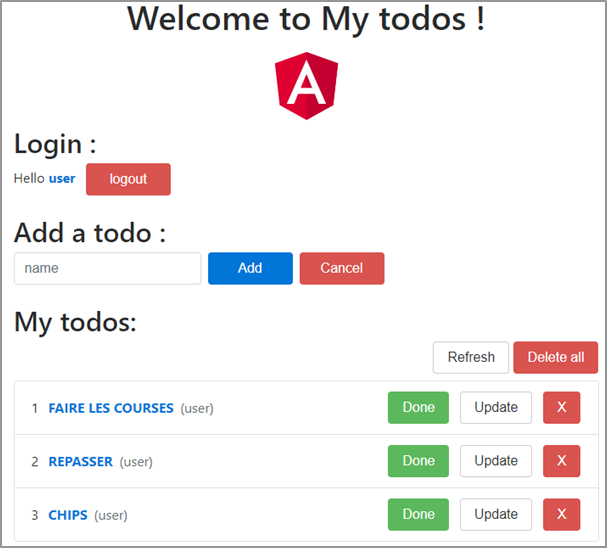
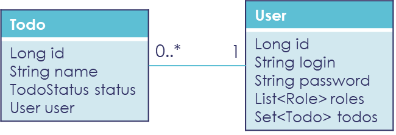
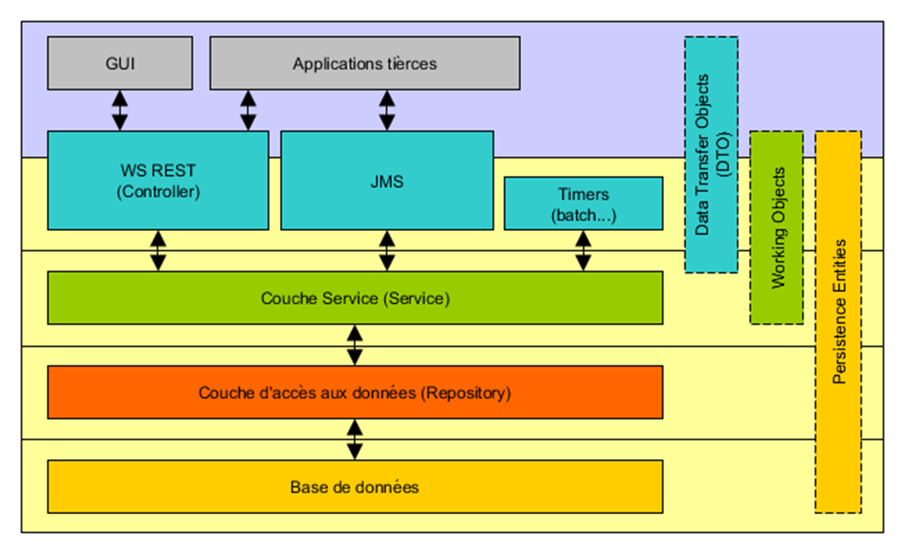
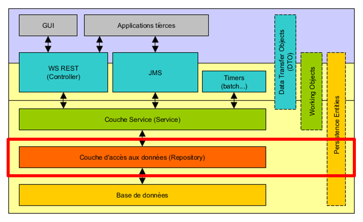
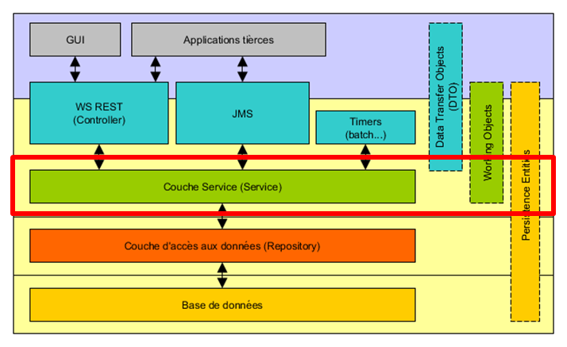
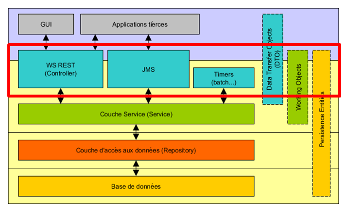
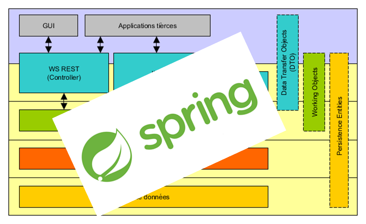
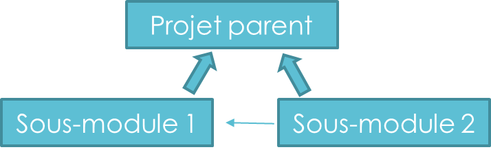
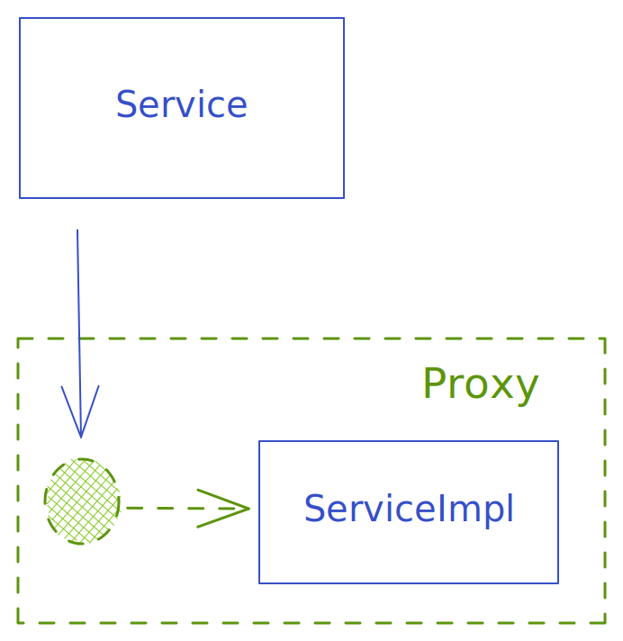
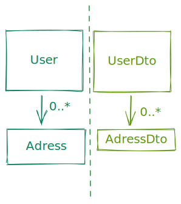

# **Formation Java Backend**

Les fondamentaux ( et un peu plus 🚀)*

## Module 1

---

# Préambule

* Tour de table
* Objectifs de la formation

---

# Plan (1/2)

- Conception générale
- Maven & Spring Boot
- Couche REST
- Couche service
- Test *unitaires*
- Outils de mapping
- Couche de persistence
- Transactions
- Validation des inputs

---

# Plan (2/2)

- Concurrence
- La sécurité
- Gestion des erreurs
- Les batchs
- JMS
- JTA
- Appels WS REST
- Bonus
    - *Les logs / Swagger / AOP*

---

# Environnement de TP (1/2)

> **JDK 11-17**:  Installer une Open JDK _via https://adoptium.net/_

- Installation dans le répertoire souhaité
- Ajout de la variable d’environnement `JAVA_HOME` pointant vers le répertoire d’installation du JDK
- Ajout du path suivant à la variable d’environnement PATH : `%JAVA_HOME%\bin`

> **Maven** : _https://maven.apache.org/download.cgi_

- Dézip dans le répertoire souhaité
- Ajout de la variable d’environnement `MAVEN_HOME` pointant sur le répertoire maven
- Ajout du path suivant à la variable d’environnement PATH : `%MAVEN_HOME%\bin`
- Mise à jour / création du ficher `C:\Users\USER\.m2\settings.xml`

---

# Environnement de TP (2/2)

- Mon IDE préféré (Eclipse / Intellij / VSCode)
    - De préférence avec les plugins pour `Spring` & `MapStruct`
- `Lombok` sera nécessaire aussi https://projectlombok.org/
- Git

--- 

# Le Projet - Introduction

Application permettant de créer une liste de tâches

- Afficher tous les Todos en cours
- Créer un Todo
- Modifier un Todo
- Clore un Todo
- Supprimer un Todo
- Supprimer l’intégralité des Todos
- Envoi d’un email à la suppression d’un Todo




---

# Conception générale - Modèle en couche



---

# Couche Persistance

## JPA - Java Persistence API

- Eclipse Link
- Open JPA
- Hibernate



<!-- 
- Premier levier d'interaction avec la base de donnée 
- Propose une abstraction en modelisation les tables comme des objects java 
- Puissant mais souvent mal utilisé (optimisation des requetes 
- D'autres alternatives existent (`JOOQ`) -->

---

# Couche Services

## Services

- Couche métier: logique applicative

## Timers / Orchestrateur

- Quartz
- Spring Scheduling



---

# Couche "Transfert"

## Interaction avec le reste du monde

* REST
    * JSR311 - Jersey/CXF
* SOAP
    * JSR224 - JAX-WS/CXF
* JMS (Java Message Service)
    * RabbitMQ
    * ActiveMQ



---

# Spring (1/2)

> Le ciment / lien entre toutes les couches

* Framework java le plus utilisé au monde
    * Alternative à un serveur d'application standard JEE
    * Conteneur `léger`
* Gère le cycle de vie des objects java (`Beans`)
* Gère l'injection de dépendances
* Propose une configuration Java ou XML



---

# Spring (2/2)

### Nombreux project / plugins sont disponibles

- Spring Boot
- Spring Cloud
- Spring Integration
- Spring Data
- Spring Batch
- Spring Security


---

# Maven

> Alternative: gradle

**Son objectif**

- Rendre le processus de build simple
- Uniformiser le processus de build et de release
- Gérer les dépendances du projet

> Commandes classiques:
> `mvn clean install`
> `mvn clean install -DskipTests`


---

# Maven - POM

```xml

<project xmlns="http://maven.apache.org/POM/4.0.0"
         xmlns:xsi="http://www.w3.org/2001/XMLSchema-instance"
         xsi:schemaLocation="http://maven.apache.org/POM/4.0.0 http://maven.apache.org/xsd/maven-4.0.0.xsd">
  <modelVersion>4.0.0</modelVersion>

  <!-- Définit généralement une organisation-->
  <groupId>com.thales.formation</groupId>
  <!-- Définit de manière unique un binaire -->
  <artifactId>formation-java</artifactId>
  <!-- Définit la version spécifique -->
  <version>0.0.1-SNAPSHOT</version>
  <!-- jar / war / ear / zip -->
  <packaging>jar</packaging>

  <parent>
    <!-- -->
  </parent>

  <properties>
    <!-- Des attributs du projet -->
  </properties>

  <dependencies>
    <!-- Les dependances du projet -->
  </dependencies>

  <build>
    <plugins>
      <!-- les plugins du projet -->
    </plugins>
  </build>
</project>
```

<!--
Le POM 'project object model' est une reprentation XML du projet et permet de définir:
- Le nom du projet
- La version
- La packaging de l'artefact
- Les attributs du projet
- Les dépendances
- Les plugins: qui sont des extensions de maven

Un point sur le packaging qui peut être:
- pom (pour déclarer uniquement des parties communes (dependances, plugins propriétés)
- jar (par défaut)
  - fonctionne souvent en standalone (_uber_ jar avec les dépendances voir, le serveur inclus)
  - souvent utilisé pour les microservices mais pas que
- war
  - packaging plutôt dédié aux serveurs d'application léger (tomcat)
  - Un seul serveur hébergeant plusieurs applications
- ear
  - packaging historique dédié aux serveurs d'application "Enterprise"
  - JEE / JBOSS
-->

---

# Maven - POM - Modules



Maven permet de définir une structure projet via les `modules`

```xml

<project xmlns="http://maven.apache.org/POM/4.0.0"
         xmlns:xsi="http://www.w3.org/2001/XMLSchema-instance"
         xsi:schemaLocation="http://maven.apache.org/POM/4.0.0 http://maven.apache.org/xsd/maven-4.0.0.xsd">
  <modelVersion>4.0.0</modelVersion>

  <groupId>com.thales.formation</groupId>
  <artifactId>formation-java</artifactId>
  <packaging>jar</packaging>

  <!-- ...  -->
  <modules>
    <module>module1</module>
    <module>module2</module>
  </modules>
</project>
```

<!-- 
Avantages d'utiliser les modules:
- Un seul commande pour tout builder
- Possibilité de builder uniquement un sous-modules
- Possiblité de mutualiser un certain nombre de paramétrage (plugin, dependencies, properties, etc..)
-->

---

# Maven - POM - Dépendances #1

- Définies via une `groupId`, `artifactId`, `version` minimum
    - _des fois on peut ajouter `classifier` ou `packaging`_
- Maven se charge de les récupérer
    - également les dépendances transitives ⚠️

```xml

<dependencyManagement>
  <!-- Souvent utiliser pour mutualiser les dépendances -->
</dependencyManagement>

<dependencies>
<dependency>
  <groupId>totoGroup</groupId>
  <artifactId>totoId</artifactId>
  <!-- La version est inutile si déjà décrite dans  "dependencyManagement"-->
  <version>1.2.0</version>
  <!-- Facultatif-->
  <scope></scope>
</dependency>
</dependencies>
```

---

# Maven - POM - Dépendances #2

- `compile` : Scope par défaut. Utilisé pour le build, test et run
- `provided` : build et test. Non embarqué dans le package car sera fournie au runtime
- `runtime` : test et run
- `test` : test
- `system` : Provided mais basé sur un chemin et non une dépendance externe (_e.g. jar local_)
- `import` : Dans le `dependencyManagement` uniquement. Permet d’importer le `dependencyManagement` d’un autre pom

---

# Maven - POM - Build #1

- Le build nous dit "comment" est construit le projet
    - Version de compilation java
    - Encoding des fichiers
    - Les étapes
    - Les plugins / extensions à configurer
        - _e.g. génération de code, fichier complémentaire à inclure, vérifications de format/code_

```xml

<build>
  <plugins>
    <plugin>
      <groupId>org.springframework.boot</groupId>
      <artifactId>spring-boot-maven-plugin</artifactId>
    </plugin>
  </plugins>
</build>
```

---

# Maven - POM - Build #2

* Maven dispose également de la notion de `profile`
    * Permet de customizer le build (_en fonction OS, variables env, autres_)

* SCM + Distribution Management
    * Concerne la « release » du projet
    * Déploie le projet dans un repository
    * Intégration avec un gestionnaire de version (ex : git, mercurial, svn…)

---

# Maven - Structure d'un projet

```bash
my-app/
├── pom.xml # Notre point d'entrée
├── src/main/java  # Le code source (qui ira en prod)
    ├── com/mycompagny/app
        ├── myjava.java
├── src/main/resources # D'autres resources embarqués (e.g. configuration, templates)
│   ├── app.properties
├── src/test/java # Le code source des tests uniquement
├── src/test/resources # resources spécifiques aux tests 
├── target/ # répertoire OUTPUT de maven 
```

---

# Maven - A retenir 📇

▌ **Uniformisation du build**
▌ **Configuration XML dans le pom.xml**
▌ **Simple car bien cadré mais difficile de s’écarter du chemin**
▌ **Jamais de dépendance « variable ». On précise la version dans sa totalité**

---

# Spring-Boot

* Permet d’accélérer le développement d’applications basées sur Spring
* Configuration pensée par/pour l’écosystème Spring
    - _il est préférable de connaître les choix et alternatives_
* Convention over Configuration
    - Une configuration implicite standard
* Intégrer facilement la plupart des fonctionnalités
    - Core: Spring Security, JTA…
    - Web: Spring MVC, Jersey, Websocket…
    - BDD : Spring Data JPA avec driver adéquat, Elasticsearch, JDBC…


---

# Spring-Boot - Intégration via des starters

- Enorme écosystème de _plugins/extension_ via des dépendances **"starters"**
    - elasticsearch, jpa, ldap, kafka, aws
- Plugin officiels mais également apportés par la communauté open source.
- Apporte une configuration par défaut _"out of the box"_
    - S'appuie sur des configurations et des annotations propres à Spring-Boot

➡️https://docs.spring.io/spring-boot/docs/current/reference/htmlsingle/#using.build-systems.starters

---

# Spring-Boot - Packaging

- Possibilité de générer un Jar exécutable embarquant un serveur

```xml

<plugin>
  <groupId>org.springframework.boot</groupId>
  <artifactId>spring-boot-maven-plugin</artifactId>
  <configuration>
    <executable>true</executable>
  </configuration>
</plugin>
```

- Mais également un war (et depuis peu, même une image Docker)

---

# Spring-Boot - Dev Experience

- Devtools (livereload + redémarrage)

```xml

<dependency>
  <groupId>org.springframework.boot</groupId>
  <artifactId>spring-boot-devtools</artifactId>
  <scope>runtime</scope>
</dependency>
```

- Autocomplétion des attributs dans votre IDE préféré

```xml

<dependency>
  <groupId>org.springframework.boot</groupId>
  <artifactId>spring-boot-configuration-processor</artifactId>
  <version>MA_VERSION</version>
  <optional>true</optional>
</dependency>
```

---

# Spring-Boot - Concrètement

Le coeur d'une application Spring-Boot, c'est:

- un `pom.xml`
- une classe main `java` annoté avec `@SpringBootApplication`

➡️https://start.spring.io/

Au démarrage, l'application

- Scanne les classes annotées @Configuration
- Analyse le classpath (nos dépendances présentes)
- Instancies les beans que l’on fournit (et ceux de nos dépendances)
    - _S’appuie sur le fichier « application.properties » (ou application.yml)_
- Possibilité de conditionner la configuration :
    - _@Conditional, @ConditionalOnProperty, @ConditionalOnMissingClass…_

---

# Spring-Boot - A retenir 📇

▌ **Simplicité de mise en place d’un projet Java**
▌ **Toujours commencer par la configuration standard avant de se lancer dans la conf avancée**
▌ **Regarder les properties disponibles pour la configuration**
▌ **Liens utiles :**

- [Home](https://projects.spring.io/spring-boot/)
- [Documentation](https://docs.spring.io/spring-boot/docs/current/reference/htmlsingle/)
- [Configuration classique](https://docs.spring.io/spring-boot/docs/current/reference/html/common-application-properties.html)

<!-- 
A noter que Spring-Boot n'est pas le seul framework !
Il se fait bousculer par des nouveaux frameworks:
- Quarkus
- Micronaut
Qui misent sur des meilleures performances au démarrage et une empreinte mémoire réduite
-->

---

# TP #1 - Spring Boot Hello World

➡️https://start.spring.io/

<!-- _class: invert -->
<!-- _backgroundImage: none -->

1. Créer votre première application via le site dédié
2. Ajouter la dépendance `Spring Web`
3. Généner le zip et ouvrer le contenu dans votre IDE préféré
4. Placer un fichier `index.html` _avec le message de votre choix_ dans `src/main/resources/public`
5. Lancer votre application, pleins d'optioons !
    - Via votre IDE (_click droit > Run as Java Application / Spring Boot App_)
    - Après un `mvn clean install` via `java -jar ./target/myapp.jar`
    - On encore via `mvn spring-boot:run`
6. Se connecter à `http://localhost:8080`

---

# API REST #1

- Késako ? [Representational State Transfer->wiki](https://fr.wikipedia.org/wiki/Representational_state_transfer)
- Protocole de communication léger le plus utilisé pour les communications web **client/serveur**
- S’appuie sur les requêtes HTTP standard
- Favorise le _"stateless"_
- Utilisation de « verbes » :
    - GET : Récupérer / chercher un objet
    - POST : Créer ou réaliser une opération sur un objet
    - PUT : Mettre à jour un objet ou en créer un lorsque l’identifiant est géré par le client
    - DELETE : Supprimer un objet

---

# API REST #2 - Terminologie

Paramètres

- Path : directement dans l’URL
    - Généralement uniquement utilisé pour les identifiants
    - `http://monsite/resource/ID1`
- Query : attribut d’URL (séparé par un `&` )
    - Généralement utilisé pour filtrer les résultats (mais pas que)
    - `http://monsite/resource?PARAMETRE1=VALEUR1&PARAMETRE2=VALEUR2`

Body

- Contenu de la requête

Headers

- Entête HTTPS

---

# API REST #2 - _Restful_ - Philosophie

▌ Découpage par "ressource"

```bash
# Récupération de touts les livres
GET :http://monsite/api/books
# Récupération d'un livre par identifiant
GET : http://monsite/api/books/25

# Ajout d'un livre d'un livre
POST : http://monsite/api/books
Body : { « title »: « Mon super livre » }

# Modification
PUT : http://monsite/api/books/25
Body : { « title »: « Nouveau titre ! » }

# Delete
DELETE : http://monsite/api/books/25
DELETE :http://monsite/api/books

# Recherche via un filtre
GET : http://monsite/api/books?title=toto

# Action sur un livre ??
POST : http://monsite/api/books/25/myactions
```

---

# API REST #3 - Les réponses

* Code `2XX`: Tout va bien
    - 200 - OK avec contenue de la réponse
    - 204 - OK, mais réponse vide
* Code `3XX`: Pour tout ce qui est redirection
* Code `4XX`: Erreur côté client HTTP
    - 403 - Accès refusé
    - 404 - La resource n'existe pas
* Code `5XX`: Erreur côté serveur
    - 500 - Erreur interne de serveur
    - 503 - Service indisponible
* 🤡 Il existe un code `418` - [je suis une théière](https://developer.mozilla.org/fr/docs/Web/HTTP/Status/418)

---

# API REST & Spring #1

```xml

<dependency>
  <groupId>org.springframework.boot</groupId>
  <artifactId>spring-boot-starter-web</artifactId>
</dependency>
```

1. Ajout de dépendances
2. Annotations de classes `@RestController` & `@RequestMapping`
3. Annotations de méthodes `@RequestMapping`

<!-- 
Par défaut Spring-Boot propose une conversion chaine de caractères <-> JSON
-->

---

# API REST & Spring #2

```java
/* Déclaration du controller */
@RestController
/* Déclaration de l'API */
@RequestMapping("/api/todos")
public class MyController {

  @GetMapping(value = "/{id}")
  public BookDto findById(@PathVariable Long id) {...}

  @GetMapping(value = "/")
  public List<BookDto> search(@RequestParam Long id) {...}

  @PostMapping(value = "/")
  public BookDto create(@RequestBody BookDto id) {...}

}
```

-> Mapping _"automagique"_ JSON/Pojo prise en compte par le framework

---

# API REST & Spring #3

▌ Retour géré automatiquement par le framework

- Si un pojo: serialisation automatique en `json` (et un statut `HTTP 200`)
    - Peut être customisé via l'objet `ResponseEntity`
- Les exceptions sont mappés également en fonction de leur nature
    - les erreurs applicatives -> `500`
    - les erreurs de validation -> `400`

---

# TP #2 - Spring Boot Web Services #1

<!-- _class: invert -->
<!-- _backgroundImage: none -->

_Préambule - une application prête-à-l'emploi est présente dans `src/main/resouces/public`_

Démarrer le serveur et accéder à la GUI !

---

# TP #2 - Spring Boot Web Services #2

<!-- _class: invert -->
<!-- _backgroundImage: none -->

_Préambule - une application prête-à-l'emploi est présente dans `src/main/resouces/public`_

1. Démarrer le serveur et accéder à la GUI !
2. Implémenter vos premières API

```bash
# Récupération de touts les todos
GET : http://localhost:8080/api/todos
# Récupération d'un todo par identifiant
GET : http://localhost:8080/api/todos/<id>
# Ajout d'un nouveau todo
POST : http://localhost:8080/api/todos
Body : { « title »: « Mon super livre » }
# Modification d'un todo existant
PUT : http://localhost:8080/api/todos/<id>
Body : { « name »: « acheter du lait » }
# Delete d'un todo
DELETE : http://localhost:8080/api/todos/<id>
DELETE : http://localhost:8080/api/todos
```

---

# TP #2 - Spring Boot Web Services #3

<!-- _class: invert -->
<!-- _backgroundImage: none -->

1. Créer un pojo `TodoDto`
    - Deux attributs : `id` (Long) & `name` (String)
2. Initialiser votre controller `TodoController`
3. Faire fonctionner au moins un API
    - On peut bouchonner en utiliser un `HashMap<Long, String>`

## ⌛⌛⌛

---
# Spring Web - A retenir 📇

▌ **Système à base d'annotations**
▌ **Spring-Boot n'est une implémentation de JSR**

- _les annotations sont différentes, les principes sont identiques :)_

▌ **Attention à faire des API Restful**
▌ **Liens utiles**

- [Documentation officielle](https://docs.spring.io/spring-boot/docs/current/reference/htmlsingle/#web)

---

# Spring - Annotations #1

Principaux type de `beans` et annotations associées :

- `@Controller` / `@RestController` : Point d'entrée REST
- `@Service`
- `@Repository`
- `@Bean`: Type généralement liée à la configuration (via `@Configuration`)

<!-- 
@RestController est une spécialisation de @Controller (avec @ResponseBody intégré)

@Service / @Repository sont des spécialisations de l'annotation @Component
-->

---

# Spring - Annotations #2

- Les beans sont des **singletons** par défaut
- Mais il existe la notion de `@Scope` également pour gérer le cycle de vie
    - `@Scope("prototype")` invoqué à chaque fois
    - **Uniquement pour des applications web**
        - `@Scope("request")`
        - `@Scope("session")`
        - `@Scope("application")`

---

# Spring - Injection de dépendances #1

* Spring fonctionne par défaut avec un "package scan"
    - _cherche dans le classpath tous les classes annotées, les instancies et résout leurs attributs_
    - le tout enregistré dans le ✨**spring application context**✨
* Injection de dépendances
    - Via l'annotation `@Autowired`
    - Via constructeur - **à privilégier**-
    - Gestion de doublons via `@Qualifier`
    - Dépendance optionnelle via l'option `@Autowired(required=false)`
```java
public class MyService {

  @Autowired
  private OtherBean otherBean;
```

---

# Spring - Injection de la configuration #2

```java
@Configuration
@ConfigurationProperties(prefix = "myprefix")
public class ServerConfig {
  private Long myprop;
}
```
- Injection de la configuration via un `@Autowired`
  - _et utiliser la conf comme un object java `serverConfig.getMyProp()`_
- L'annotation `@Value(${myprefix.myprop:default_value})`
```java
@Value("${security.timeout:10}")
private Long timeout;
```

<!-- 
La configuration comme objet java possède les avantages de tout centraliser
- on peut configurer le comportement du framework (erreur si attributs non présent, etc..)

- `@Value` est également vérifiée au démarrage si pas de valeur par défaut 
-->

---

# Spring - Mécanisme de "proxification"

- Spring crée un proxy de chaque bean managé et chaque méthode visible (`public`)
  - _Non pris en compte pour les **méthodes privées ou appel interne**_ 🚨
- Ainsi le comportement "enrichi" de Spring se trouve dans le proxy
  - _Gestion de transactions_
  - _Cache_
  - _Exceptions / Transformations_

<!-- 
Spring propose deux types de proxy:
- Si via une interface, Spring créer une implémentation de l'interface
- Sinon s'appuie sur cglib/javassit/bytebuddy pour gérer une classe qui étend le service
-->

---
# Spring - Cycle de vie

Possibilité d'utiliser les annotations `@PostConstruct` & `@PreDestroy`
- `@PostConstruct` : appelé une fois que le Spring Context est initialisé. _utile pour lancer un code au démarrage_
- `@PreDestroy`: appelé à la destruction du Bean

<!-- Conseil : de pas mettre trop de logique dans le @PostConstruct, cela ralentit autant le démarrage de 
l'application -->

---
# TP #3 - Mon premier service Spring

<!-- _class: invert -->
<!-- _backgroundImage: none -->

1. Impacter le modèle
   - Créer un modèle `Todo.java` à l'image du `TodoDto.java`
   - Ajouter un attribut `status` via l'enum `TodoStatus.java` (valeurs : _TODO_, _COMPLETED_)
2. Créer un service Spring de gestion de "todos" (`TodoService.java`)
3. Câbler l’appel du service depuis le contrôleur `findAll` 
4. S’assurer que la GUI continue à fonctionner 
5. A l’aide d’une HashMap pour stocker les Todo faire l’implémentation complète du service et du controller
```java
private AtomicLong atomicLong = new AtomicLong();
atomicLong.getAndIncrement()
```
Au niveau du contrôleur REST, récupérer les Todo et les transformer en Dto

6. Tout doit fonctionner dans la GUI

---
# Spring - A retenir 📇

▌ **Attention aux dépendances circulaires** (_e.g. A injecte B qui injecte A_)
▌ **Proxification - maitrisez vos appels internes / méthodes privés**
▌ **Ne pas abuser de `@PostContruct`**

---
# Lombok

- Lib java permettant d'écrire moins de code
- Via un jeu d'annotations permettant de générer du code
  - `@Getter/@Setter`
  - `@ToString`
  - `@Slf4j`: Ajoute un logger 
  - `@Data`
- `@Accessors(chain=true)` : les setters retournent `this` au lieu de `void`
➡ Plus de features sur le [site officiel](https://projectlombok.org/features/all)

---
# TP #4 - Lombok

<!-- _class: invert -->
<!-- _backgroundImage: none -->

- Ajouter la dépendance lombok
```java
<dependency>
    <groupId>org.projectlombok</groupId>
    <artifactId>lombok</artifactId>
    <version>VERSION</version>
    <scope>provided</scope>
</dependency>
```

- Remplacer les Getter / Setter de Todo et TodoDto par du lombok
- Utiliser `@Accessors(chain=true)` afin d’utiliser une écriture plus "fluent"

---
# Lombok - A retenir 📇

- Pas indispensable (_surtout en JDK 17_) mais rend bien service
- Rend les pojo plus lisibles
- On sort un peu des clous…
- Intégration pas toujours évidente dans l’IDE
- Attention à la génération de code et aux preprocessors maven (_e.g. Mapstruct_) 

---
# Mapstruct

- Librairie Java permettant de faire du "mapping" entre les objets
- Alternative "Dozer" : 💥 **A proscrire**
  
- Dozer
  - Introspection au runtime -> Mauvaise performance
  - Erreurs au runtime -> Risque de régression important
- Mapstruct
  - Code généré -> Performance "iso" dev manuel
  - Erreurs à la compilation -> Possibilité de faire des refactoring "sereinement"

---
# Mapstruct - Howto

```java
/** Une interface suffit !
 *  Le component model permet une intégration avec Spring (via @Autowired) */
@Mapper(componentModel = "spring")
public interface MyEntityMapper {

  /** Pour transformer MyEntity -> MyEntityDto
   *  Une nouvelle instance est crée */
  MyEntityDto myEntityToMyEntityDto (MyEntity myEntity);
  
  /** Pour mettre à jour MyEntity à partir MyEntityDto
   *  via @MappingTarget */
  void myEntityDtoToMyEntity (MyEntityDto myEntityDto, @MappingTarget MyEntity myEntity);
}
```

---
# Mapstruct - Mapping #1
- Mapping implicite :
  - Mapping via les getter / setter de même nom

- Mapping explicite : via l'annotation `@Mapper`
  - Mapper un attribut vers un autre avec un autre nom
    `@Mapper(target = "id", source = "ref")`
  - Mapper un sous attribut :
    `@Mapper(target = "addressLine1", source = "address.line1")`
  - Ignorer un attribut
    `@Mapper(target = "addressLine1", ignore = true)`

---
# Mapstruct - Mapping #2
- Mapper vers une constante
  `@Mapping(target = "scopeMode", expression ="java(com.app.ScopeMode.IVD)")`
- Mapper vers du code Java (⚠ _se limiter à des choses simples !_)
  `@Mapping(target = "withError", expression = "java(myModel.getError ()!=null)"`
- Mapping de liste :
  `List<MyEntityDto> myEntitiesToMyEntityDtos(List<MyEntity>)` 

🚨 Mapstruct n’appelle pas automatiquement les `Decorator` _(voir plus loin)_

---
# Mapstruct - Mapping #3



Possibilité de "réutiliser" les mappers
- _e.g. Le mapper `UserMapper` a besoin de `AddressMapper`_

➡  `@Mapper(uses = { AddressMapper.class })`

---
# Mapstruct - Mapping #4 - Decorators

```java
@Mapper(componentModel = "spring")
@DecoratedWith(MyEntityMapperDecorator.class)
public interface MyEntityMapper {
  MyEntityDto modelToDto(MyEntity myEntity);
}

public abstract class MyEntityMapperDecorator implements MyEntityMapper {

  @Autowired
  @Qualifier("delegate")
  private MyEntityMapper delegate;

  @Override
  public MyEntityDto modelToDto(MyEntity myEntity) {
    MyEntityDto entityDto = delegate.modelToDto(myEntity);
    
    // Ajouter la logique "complexe" ici 
    
    return entityDto;
  }
}
```

<!-- 
Use case : enrichissement complexe d’un élément mappé (exemple : faire appel à un service)

- Classe abstraite implémentant l’interface de mapping

- Possibilité d’injecter le mappeur principal généré pour l’appeler dans un premier temps (@Autowired @Qualifier("delegate"))

- Annoter le Mapper pour lui dire d’utiliser le décorateur: @DecoratedWith(MyEntityMapperDecorator.class)
-->

---
# Mapstruct - Mapping #5 - Gestion des erreurs

- Plusieurs mode pour gérer un différence d'attributs entre source / target
  - `IGNORE`
  - `WARNING` _valeur par défaut_
  - `ERROR` _à privilégier (erreur en amont, surtout en cas de refactoring)_

➡  `@Mapper(unmappedTargetPolicy = ReportingPolicy.ERROR)`

---
# TP #5 - Mapstruct

<!-- _class: invert -->
<!-- _backgroundImage: none -->

1. Ajouter les dépendances MapStruct: cf. [documentation officielle](https://mapstruct.org/documentation/stable/reference/html/#_apache_maven)
2. Créer le Mapper `TodoMapper.java`
3. L’utiliser dans le service et le contrôleur
4. S’assurer que tout continue à marcher dans la GUI 😊
5. Créer un `Decorator` et faire la transformation souhaitée à la création (_e.g.  passer en majuscule le nom_)

---
# Mapstruct - A retenir 📇

▌ Erreur de compilation = Sécurité

▌ Performances proches du code natif

▌ Peut malgré tout vite devenir complexe en particulier lorsqu’on commence à utiliser les décorateurs (découpage du mapping à plusieurs endroits)

▌ Attention au mapping pour la mise à jour d’entités (ne pas tout mapper !)

---
# Fin module 1

## 🎉