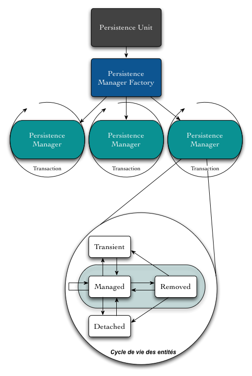
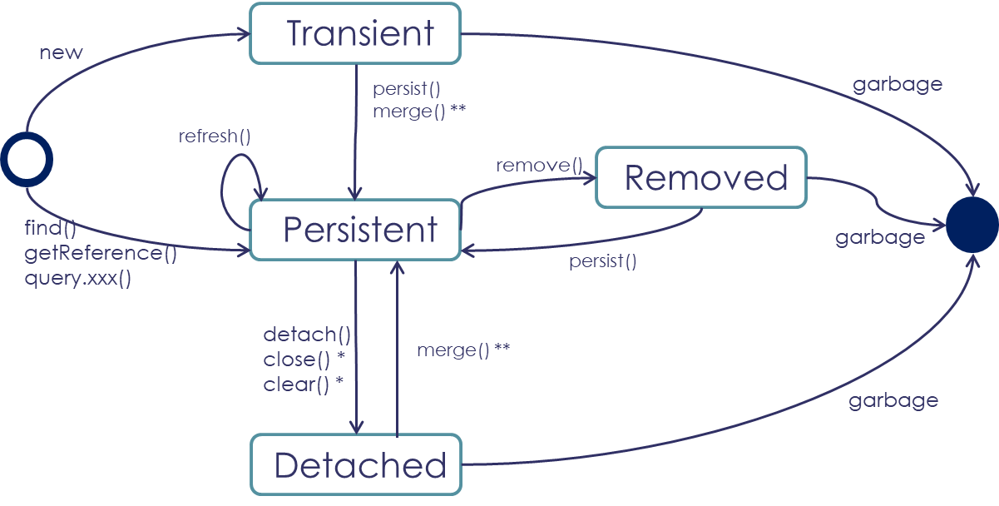
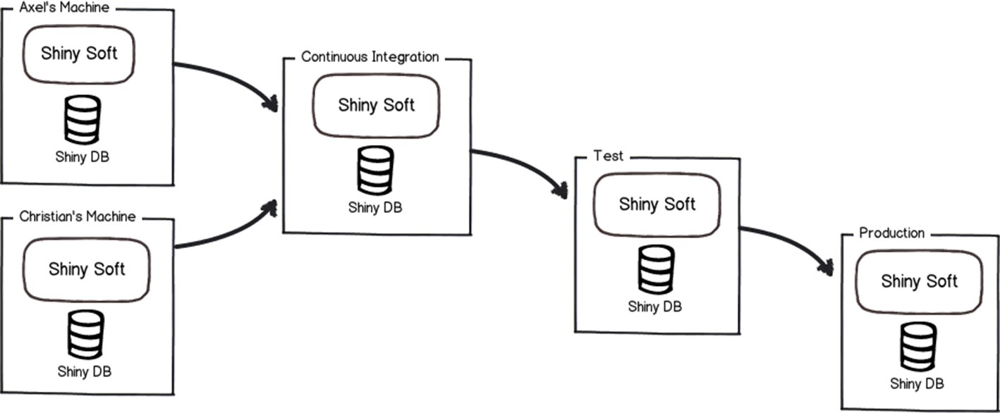
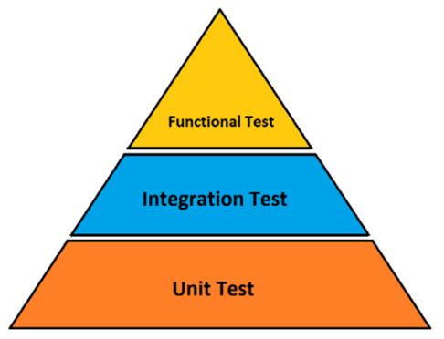
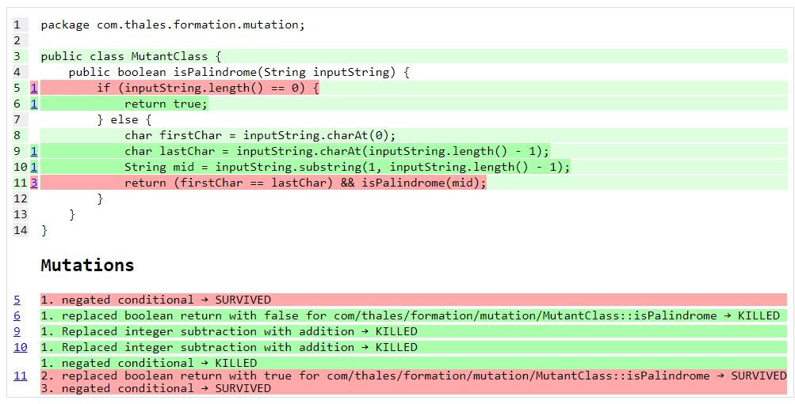
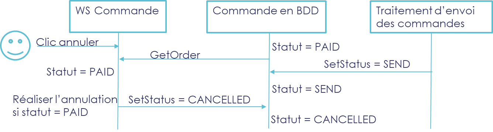

# **Formation Java Backend**

Les fondamentaux (et un peu plus 🚀)

## Module 2

---
# Hibernate - Intro

- ORM (Object/Relational Mapping) -> Abstraction du modèle BDD
- Gère la correspondance entre le modèle en BDD et le modèle Java
- Gère la persistance / cycle de vie de vie des objets Java en BDD
    - _"Transformation" du résultat d’une requête en des objets Java en mémoire_
    - _Mise à jour de la BDD (en générant des requêtes SQL)_
- Mécanisme de mise en cache des objets
- S’appuie sur l’API `JDBC` (Java Database Connectivity)
- Possibilité de naviguer naturellement dans un graphe d’objets : `user.getAdresse().getVille()` ⚠ _Attention à ce que cela implique !_
- Possibilité de générer automatiquement le schéma de la BDD (à partir du modèle Java)

<!--
Object Relation Mapping

Paradigm mismatch
Le modèle objet et le modèle relationnel de données ne sont pas conçus avec les mêmes contraintes. Il y a donc fréquemment des différences de structure qui rendent le mapping parfois délicat.

Granularité
Par exemple, une personne a une adresse. Côté base de données, les champs relatifs à l’adresse peuvent être dans la table Personne, au même titre que nom, prénom, …
Côté objet en revanche, il peut être intéressant d’avoir une classe Adresse pour utiliser cette notion avec d’autres objets que la Personne.
On voit donc qu’il y a une différence de structure.

Héritage
Existe dans le monde objet, mais pas dans le monde relationnel. Hibernate propose plusieurs moyen de représenter cette notion d’héritage.

Identité
Pas forcément équivalent entre les 2 mondes.
2 identités côté Java :
Identité en mémoire : obj1 == obj2
Egalité par valeur, basée sur l’implémentation de la méthode equals()
1 côté relationnel : la PK

On voit bien qu’il n’y a pas d’équivalence naturelle entre les 2 types Java et la PK.

Associations
Dans le monde objet, une association est une référence vers un autre objet.
Dans le monde de la base de données, une association est définie par une FK, avec copie de la valeur de la clé.
Un autre problème dans le monde objet est que si la relation doit pouvoir être parcourue dans les 2 sens, il faut la définir des 2 côtés (dans les 2 classes).

Navigation
Naviguer dans un graphe d’objets se fait naturellement, en passant d’un objet à l’autre grâce aux références : user.getAdresse().getVille()
Côté base de données, c’est une autre histoire puisque plusieurs requêtes sont nécessaires.
-->

---
# Hibernate - Contexte de persistance #1


- Gestion des entités persistantes
    - `Session` dans Hibernate
    - `EntityManager` pour JPA
- Plusieurs services
    - Cache de premier niveau
    - Dirty checking
    - Identité des objets
    - Conversations

<!-- 
Le contexte de persistance n’est pas quelque chose que l’on voit dans l’application. Il s’agit d’une sorte de cache dans lequel sont gérées les entités, au cours d’une unité de travail.

Hibernate : une session contient un contexte de persistance.

Cache
Le contexte de persistance garde en mémoire les entités manipulées au cours d’une unité de travail.
Outre le dirty checking, ce cache permet d’améliorer les performances de gestion des entités, notamment lors du chargement d’une entité ou bien dans le chargement des résultats d’une requête.
Ce cache permet alors d’éviter des sollicitations inutiles de la base de données.

Attention : Lors du parsing du résultat d’une requête, Hibernate essaye d’abord de résoudre chaque entité dans le contexte de persistance.  S’il trouve une entité, c’est celle-ci qui va être retournée, même si  l’enregistrement en base est plus récent.
-->
---
# Hibernate - Contexte de persistance #2



<!-- 
Transient : l’instance n’est pas connue par la session Hibernate. Son identifiant n’est pas renseigné.

Persistent : l’instance est affectée à une session. Son ID est renseigné.

Removed : la suppression de l’instance est prévue dans l’unité de travail. L’instance est toujours rattachée à la session. Il ne faut pas utiliser une instance dans cet état.

Detached : La session est fermée, mais le programme à toujours une référence vers l’entité. Celle-ci peut être utilisée, mais le fait qu’elle ne soit plus attachée à une session fait que toute modification ne sera pas répercutée dans la base de données.

C’est Hibernate qui gère le cycle de vie des entités qui lui sont confiées.
-->

---
# Hibernate - Mapping d’une entité

- `@Entity`
- `@Table`
- `@Id`
    - `@GeneratedValue`
- `@Column`
    - Nullable et autres caractéristiques
    - `@Formula`, `@Embedded`, `@Type`, `@Enumerated`
- `@Embeddable`
- `@Transient`

<!-- @Entity permet simplement d’indiquer que cette classe est une entité. Cette annotation est prise en compte par le scan Hibernate (ou bien LocalSessionFactoryBean de Spring)

@Id : détermine la stratégie d’accès entre propriété et méthode.

@Embeddable : regroupement d’un sous ensemble de colonnes de la table dans une classe à part entière. Par exemple si une table Utilisateur contient toutes les colonnes relatives à l’adresse de l’utilisateur, on peut être amené à créer une classe Adresse pour manipuler cette information.
-->

---
# Hibernate - Mapping d’une association #1

- `@OneToOne`
- `@Embedded`
- `@ManyToOne`
    - Associé à une propriété de type bean
    - Par défaut `EAGER`
- `@OneToMany`
    - Associé à une propriété de type liste
    - Pendant bidirectionnel de `@ManyToOne` via `mappedBy="xxx"`

---
# Hibernate - Mapping d’une association #2

▌ **FetchType.LAZY**

L’objet associé n’est récupéré (_= requête_) qu’à la demande (_appel du getter_)

▌ **FetchType.EAGER**

L’objet associé est récupéré directement lors de la requête initiale
Plusieurs stratégies possibles grâce à l’annotation `@Fetch`
- JOIN (par défaut) : utilisation d’une jointure externe
- SUBSELECT : Utilisation d’une sous requête pour chaque élément
- SELECT : Utilisation d’une requête qui récupère tous les éléments

<!-- 
LAZY: ⚠ Un parcours d’objets en "Lazy" peut induire beaucoup de requêtes !

EAGER:
⚠ Laissez JOIN à moins d’avoir une bonne raison
⚠ Attention ! A utiliser avec parcimonie. N’abusez pas de EAGER sinon vous allez finir par monter toute la base en mémoire…
-->

---
# Hibernate - Cascading

▌ **Persistance transitive**

Propager des changements à travers une association

▌ **Types**

`ALL`, `DETACH`, `MERGE`, `PERSIST`, `REFRESH`, `REMOVE`

```java
@OneToMany(mappedBy = "user", orphanRemoval = true, cascade = CascadeType.PERSIST)
private Set<Adresse> adressSet = new HashSet<>();
```
<!--
Bonne pratique
Utiliser dans des cas où on fait de l’agrégation et de la composition

Agrégation
Librairie – Livre

Composition = agrégation avec un lien plus fort
Livre - Chapitre
-->

---
# Hibernate - Héritage #1


- L'héritage est une notion object (java), mais pas de la SGBD
- On utilise l'annotation `@Inheritance` sur la class mère `@Inheritance(strategy = InheritanceType.JOINED`

---
# Hibernate - Héritage #2

▌ **Plusieurs stratégies possibles**
- `JOINED` :
  - 1 Table commune où sont stockés les attributs communs
  - 1 Table par sous-classe avec une foreign key `@PrimaryKeyJoinColumn`
- `TABLE_PER_CLASS` :
  - 1 Table pour sous-classe
  - Il n’est alors plus possible d’utiliser les ID auto générés
  - Pas possible de récupérer "n’importe quel type" à partir d’un ID
- `SINGLE_TABLE` :
  - Regroupe tous les champs dans la même table
  - Il faut préciser la colonne et la valeur discriminante 
  - Beaucoup de colonnes à NULL

---
# Hibernate - @NamedQueries
- Requêtes précompilées par Hibernate et validées au démarrage
- Utilisation du `HQL`
- Annotation `@NamedQueries` composée de plusieurs `@NamedQuery` à positionner sur l’entité
- Possibilité de passer des paramètres en les nommant « :PARAM1 »
```java
/** Définition sur l'entité */
@NamedQuery(
        name = "DeptEmployee_FindByEmployeeNumber",
        query = "from DeptEmployee where employeeNumber = :employeeNo")

/** Usage  */
Query<DeptEmployee> query = session.createNamedQuery("DeptEmployee_FindByEmployeeNumber",
        DeptEmployee.class);
query.setParameter("employeeNo", "001");
DeptEmployee result = query.getSingleResult();
```

---
# Hibernate - Point perf

- Dans les import/exports par exemple
  - Garder la taille du contexte de persistance au minimum

- ⚠ Pas de réduction automatique

- Faire de la place
  - `em.detach(item);`
  - `em.clear();`

- Session en read only
  - `em.unwrap(Session.class.setDefaultReadOnly(true);`
  - `em.unwrap(Session.class.setDefaultReadOnly(item, true);`
  - Utilisation de StatelessSession (Non JPA compliant)

<!-- 
Entités dans l’état persisted sont toujours référencées par le contexte de persistance
Pas de garbage collection !!!!

Batch sur Myla
Volume = 10 000 entités
On voit clairement le temps de traitement qui s’allonge pour chaque entité

Solution : un clear() toutes les 50 entités.
-->

---
# Hibernate - A retenir 📇

▌ La magie a un prix, attention à ce qui se cache derrière 🤓

▌ Privilégier les annotations JPA à celles d’Hibernate

▌ Attention à la taille du cache lors d’un traitement batch

▌ Attention au "lazy loading" et "eager fetching" 🚨 Bien identifier les cas 🚨

---
# Spring Data JPA

▌ API Spring pour simplifier l’accès aux données

▌ Offre des méthodes natives pour réaliser du CRUD et pagination

▌ Abstraction des sources de données (_JPA, MongoDB, ElasticSearch…_)

---
# Spring Data JPA - Intégration

- L'intégration se fait via l'interface`Repository`
  - `Repository` > `CrudRepository` > `PagingAndSortingRepository` > `JpaRepository`
  
```java
public interface UserRepository extends PagingAndSortingRepository<User , Long> {
	
}
```

---
# Spring Data JPA - Intégration

- la logique repose entre autres via des règles implicites -> règles de nommages des méthodes
  - Tronc Commun : `findBy` ➕ Attribut sur lequel rechercher
  - Filtre : `Containing` / `GreaterThan` / `In` / `IsTrue` / `IsFalse` …
  - Négation du filtre : `Not`
  - Filtres complémentaires : `And` / `Or`
  - Tri
    - `OrderBy`
    - Sens du Tri: `Asc` ou `Desc`

```java
List<Todo> findByStatusOrderByDateAsc(TodoStatus todoStatus);
```

---
# Spring Data JPA - Type de retours

▌ `MyEntity`

Le requête un et un seul élément

▌ `Optional<MyEntity>`

Le quête retourne 0 ou 1 élément

▌ `List<MyEntity>`

La requête retourne 0 ou n éléments

▌ `Stream<MyEntity>`

La requête retourne 0 ou n éléments. Le résultat sera streamé

---
# Spring Data JPA - Intégration

- On peut aussi utiliser `Query` pour définir une requête
```java
@Query("select u from User u where u.emailAddress = ?1")
User findByEmailAddress(String emailAddress);
```
- Cela fonctionne aussi en cas d'update/delete
```java
@Modifying
@Query("UPDATE Company c SET c.address = :address WHERE c.id = :companyId")
int updateAddress(@Param("companyId") int companyId, @Param("address") String address);
```

<!--
Le nom n’a plus d’importance

Annotation @Modifying en cas d’update / delete

Nommage des paramètres implicite ou explicite

Possibilité de faire du SQL natif
-->

---
# Spring Data JPA - Intégration

- La notion de `@NamedQuery` fonctionne pareille mais définie au niveau de l'entité (classe)
```java
@Entity
@NamedQuery(name = "User.findByEmailAddress",
  query = "select u from User u where u.emailAddress = ?1")
public class User {
}

public interface UserRepository extends JpaRepository<User, Long> {

  User findByEmailAddress(String emailAddress);
}
```

---
# Spring Data JPA - QueryHints

- Les `@QueryHints` / `@QueryHint` permettent d’influencer l’exécution des requêtes.
  - `HINT_FETCH_SIZE`: par lots de combien les résultats sont récupérés et montés en mémoire
  - `SPEC_HINT_TIMEOUT` : timeout de requête en millisecondes
  - `HINT_CACHEABLE` : utilisation du cache de niveau 2
  - `HINT_READONLY` : requête readonly -> Pas de dirty check
```java
@QueryHints(value = @QueryHint(name = org.hibernate.jpa.QueryHints.HINT_FETCH_SIZE, value = "1000"))
@Query("SELECT t FROM Todo t")
Stream<Todo> streamAllToExport();
```

---
# Spring Data JPA - Extension du repository

```java
interface CustomizedUserRepository {
  void someCustomMethod(User user);
}
class CustomizedUserRepositoryImpl implements CustomizedUserRepository {

  public void someCustomMethod(User user) {
    // Your custom implementation
  }
}
interface UserRepository extends CrudRepository<User, Long>, CustomizedUserRepository {

  // Declare query methods here
}
```

<!--
Possibilité d'ajouter des comportements custom au Repository
- Avec une interface
- Une implémentation (convention avec un `Impl` qui peut ne pas dépendre de JPA 
(e.g. injecter l’entity manager ou un JdbcTemplate pour créer des requêtes)


Enfin venir étendre une interface avec le Repo Spring + le repo Custom rend toutes les méthodes disponibles pour les clients
-->

---
# Spring Data JPA - A retenir 📇

▌ **Named query pour les perfs pures VS query dynamiques…**

▌ **🚨 Les `@Entity` ne peuvent pas être des `record`**

▌ **Liens utiles :**

[Doc officielle](https://docs.spring.io/spring-data/jpa/docs/current/reference/html/)


---
# TP #6 - Spring Data Jpa
<!-- _class: invert -->
<!-- _backgroundImage: none -->
- Nouvelle dépendances

```xml
<dependency>
    <groupId>org.springframework.boot</groupId>
    <artifactId>spring-boot-starter-data-jpa</artifactId>
</dependency>
<dependency>
  <groupId>com.h2database</groupId>
  <artifactId>h2</artifactId>
</dependency>
```

- Annoter la classe Todo comme il se doit (`@Entity`, `@Id`)
- Créer le repository de Todo implémentant l'interface `JpaRepository`
- Déclarer la méthode `findByStatus` dans le TodoRepository
- Câbler le `TodoService` sur le `TodoRepository`
- Utiliser la [console H2](http://localhost:8086/h2-console) pour visualiser le contenu de la base de données

<!-- 
Il est important de montrer au stagiaire que dans la correction du TP6, les méthodes du service `update` et `complete` 
ne fonctionnent pas à cause de l'absence de contexte transactionnel
-->

---
# Les transactions 

- Si aucune transaction n’a été débutée, Spring Data JPA en crée une le temps de l’opération unitaire
  - _Exemple : à l’appel de la méthode « save », « findById »…_
- Mais il est possible que l'on souhaite que la transaction englobe la totalité de notre opération métier
  - Utilisation de l’annotation Spring `@Transactional`
  - Quelques paramètres possibles :
    - `propagation` : `REQUIRED` / `MANDATORY` / `REQUIRES_NEW` / ...
    - `readOnly` : La transaction est-elle read only ou non
    - `timeout` : Timeout de tranasction
    - `noRollbackFor` : Exceptions qui n’entraînent pas un rollback
    - `isolation` : décrit comment les modifications appliquées entre des transactions concurrentes sont visibles entre elles

<!--
Remarque : Hibernate réalise un dirty check juste avant la fin de la transaction pour identifier les éléments à mettre à jour
-->

---
# TP #7 - Les transactions
<!-- _class: invert -->
<!-- _backgroundImage: none -->

1. Implémenter l’Update de Todo

Utiliser le mapper mapstruct pour faire la modification
Ne pas mettre de transaction ni appeler « save » pour voir que l’entité n’est pas mise à
jour car elle est détachée

2. Ajouter un annotation afin de mettre en place une transaction

Vérifier que la mise à jour fonctionne

3. Finir d’implémenter l’API Todo

---
# Les transactions

- Les transactions permettent de garantir l’intégrité de la base vis-à-vis de plusieurs requêtes / traitements
  - Tant que la transaction n’est pas commitée, les mises à jour en BDD ne sont pas « confirmées »
  - Il est possible de « rollbacker » les modifications (ex : déclenchement d’une exception, contrainte en base de données…)

- A noter que les données non encore commitées n’ont pas d’existence pour les autres connexions

> Ne s’applique qu’aux SGDB transactionnels ! (ex : MySQL, Posgresql…)

<!--
Exemple 
Udpate with exception
Create with exception after save
Create with exception after save no @Transactional
-->

---
# Les outils de migrations de données



<!--
Dans quel état se trouve la base ?
Est-ce qu’un script a déjà été passé?
Est-ce qu’un quick fix apporté à la prod et été déporter sur la val?
Comment partir d’un BDD from scratch ?

Le plus souvent on est capable de répondre 
-->


---
# Outils de migration de base de données – Pourquoi ?

▌ On le fait déjà dans notre code 

- Versionning du code source est universel
- Builds reproductible et intégration continue
- Release et déploiement maitrisés

▌ Les outils de migrations nous redonne le contrôle de la BDD

- Recréer de base « from scratch »
- Rendre lisible quel changement a été apporté et quand
- Migrer de façon déterministe et reproductible (idempotence ftw)
- Tout ça dans du code accessible à tous qui peut suivre le même workflow que notre code (test, code review, …)

---
# Les outils de migrations de données

▌ **Deux principaux outils dans le monde JVM**

- Liquibase
- Flyway

▌ **Similitudes**

- Deux offres gratuites vs premium
- Utilisation de SQL pour les scripts de migrations
- Large support de base de données
- Peuvent être lancés depuis une application ou la ligne de commande

---
# Les outils de migrations de données - différences

▌ **Liquibase**

- Permet de gérer plus facilement le rollback (payant sur Flyway)
- Permet de générer automatiquement des diffs de base de données
- Offre une DSL qui permet de viser plusieurs bases avec les mêmes scripts (XML)
- Gestion de préconditions
- Plus d’options mais aussi potentiellement plus complexe à appréhender

▌ **Flyway**

- SQL only
- Simple, léger, efficace

---
# TP 7.1 - Outils de migration de base de données
<!-- _class: invert -->
<!-- _backgroundImage: none -->

▌ Liquibase

Ajouter la dépendance
```xml
<dependency>
    <groupId>org.liquibase</groupId>
    <artifactId>liquibase-core</artifactId>
</dependency>
```

- Créer un fichier `src\main\resources\db\changelog\db.changelog-master.yaml`
  - Contient la création de la table en YAML (https://docs.liquibase.com/concepts/changelogs/yaml-format.html)

---
# Test unitaires



▌ **Tests unitaires :**

- Test des méthodes d’une classe _(ex : un Service)_
- Mock des interactions avec les autres briques
- Rapide à mettre en place et exécuter

▌ **Tests d’intégrations :**

- Les composants interagissent les un avec les autres

▌ **Tests fonctionnels :**

- Tests à partir des interfaces

---
# Test unitaires - Bonne pratiques

▌ Les tests doivent être joués en isolation

▌ On teste des comportements – pas des implémentations

Testons les APIs publique

▌ Opter pour une méthodologies Red – Green – Refactor

Commencer par un test pour valider / cibler un comportement
Faire une première implémentation « sale » mais qui fonctionne
On refactor
- Lisibilité / Nettoyage
- Déduplication / Application de Patterns

---
# Junit 5 

▌ Emplacement identique que le code (« package/dossier ») mais dans `src/test/java`

▌ Le plus simple test

- `@Test` -> `org.junit.jupiter.api.Test` 
- Annotation `@BeforeAll` : Exécuté une seule fois avant le premier test
- Annotation `@BeforeEach` : Exécuté avant chaque test
- De même avec `@AfterEach` / `@AfterAll`
- `@DisplayName` bien pratique pour expliciter le test par rapport à une méthode

---
# Test unitaires - librairies d'assertions

▌ AssertJ

API de validation de test
- `assertThat(XXX)` : `XXX` la valeur à valider
- `isEqualTo(…)` / `startsWith(…)` / `endsWith(…)` / `hasSize(…)` / `contains(…)`

Exemple : `assertThat(frodo.getName()).isEqualTo("Frodo");`

- Assertions en filtrant des valeurs / voir même des attributs
- Assertions sur les exceptions

Surtout n’hésitez pas à [lire la documentation](https://github.com/assertj/assertj-examples/tree/main/assertions-examples/src/test/java/org/assertj/examples)

---
# Test unitaires - librairies de mock

▌ Mockito

- Utile pour les tests unitaires
- Permet de bouchonner les appels à un service tiers
  - _Exemple : simuler l’appel à un service externe (REST, Database)_

```java
// you can mock concrete classes, not only interfaces
LinkedList mockedList = mock(LinkedList.class);

// stubbing appears before the actual execution
when(mockedList.get(0)).thenReturn("first");

String value= mockedList.get(0);
assertEquals(value, "first");
verify(mockedList).get(0);
```

---
# Test unitaires - mutation

▌ [PiTest](https://pitest.org/)

- Améliorer la robustesse de vos tests !
  - Faire passer vos tests sur des versions "mutées" de votre code
  - Si le test est toujours passant, un "mutant" a survécu, il faut rajouter un test !

- Après installation et configuration des dépendances et plugins JaCoCo (code coverage) et PiTest (mutation testing)
```shell
mvn test
mvn jacoco:report           # construit un rapport de code coverage
mvn pitest:mutationCoverage # construit un rapport de mutation dans target/pit-reports
```

---
# Tests unitaires - mutation (rapport)

> Seul test existant
```java
    @Test
    public void whenPalindrom_thenAccept() {
        MutantClass palindromeTester = new MutantClass();
        assertTrue(palindromeTester.isPalindrome("noon"));
    }
```

> Rapport


---
# Test unitaires - Spring Boot

- Context d’exécution : `@ExtendWith(SpringExtension.class)`

On peut tester chaque couche en isolation
- `@SpringBootTest` -> Context Spring complet
- `@WebMvcTest` -> Couche controller
- `@DataJpaTest` -> Couche Repository
- Couche service -> ? 
  - Via un context spécifique

<!--
`@WebMvcTest` -> utile pour tester la couche WEB - Auth, Html Converters, Exception handlers, filter
`@DataJpaTest` -> pour tester vos repos
-->

---
# Test unitaires - Spring Boot

Option full `Mockito`
```java
@ExtendWith(MockitoExtension.class)
class TodoServiceTest {
  	
  @Mock
  private TodoRepository todoRepositoryMock;
  
  @InjectMocks
  private TodoService todoService;
}
```
Via `MockitoJUnitRunner.class`, `@Mock`, `InjectMocks` 

---
# Test unitaires - Spring Boot

Option intégrée à Spring
```java
@SpringBootTest
class TodoServiceSpringBootTest {
  
  @MockBean
  private TodoRepository todoRepositoryMock;
  
  @Autowired
  private TodoService todoService;
}
```
Via `@MockBean`

---
# TP 8 - Test unitaires
<!-- _class: invert -->
<!-- _backgroundImage: none -->

```xml
<dependency>
  <groupId>org.springframework.boot</groupId>
  <artifactId>spring-boot-starter-test</artifactId>
  <scope>test</scope>
</dependency>
```

1. Ajouter la dépendance `spring-boot-starter-test`
2. Créer un test unitaire pour TodoService (_avec Mockito_)
   - `src/test/java : com.thales.formation.service.TodoServiceTest.java`
3. Créer un test unitaire pour TodoRepository (_avec @DataJpaTest_)
   - `src/test/java : com.thales.formation.repository.TodoRepositoryTest`
4. Créer un test d’intégration pour TodoService
   - Avec `@SpringBootTest`

Faire un test s’assurant que findAllNotCompleted retourne bien 2 éléments

<!-- 
Exécuter les commandes 

```
mvn test
mvn jacoco:report
mvn pitest:mutationCoverage
```

et montrer le rapport dans target/pitest pour expliquer le principe du mutation testing
-->

---
# Test unitaires - A retenir 📇

- Un indicateur d'un code bien testé se définit par la qualité, pas la quantité des tests
- Les services / configuration de test doit se rapprocher autant de possible de la prod afin de limiter les risques d’erreur
- Ne tester pas 100 fois la même chose
- Un test pour éviter une régression
- Utiliser l'approche TDD si possible (Red-Green-Refactor)
- Améliorer la robustesse de vos tests avec la mutation

---
# TP Test Driven Development
<!-- _class: invert -->
<!-- _backgroundImage: none -->

On déroule ensemble le kata [FizzBuzz](https://codingdojo.org/kata/FizzBuzz/)

---
# HibernateValidator - Validation des entrées

- Implémentation de Bean Validation (JSR 380)
- Bootstrap par `spring-boot-starter-validation`
- Objectif : Vérifier la validité des données au plus tôt
-> Validation des entrées (REST, JMS…)
- 🚨 Ne pas confondre avec l'ORM Hibernate

---
# HibernateValidator - Validation des entrées

- `@NotNull` : Champ non null
- `@Min` : Valeur (int, float…) minimale ou longueur minimale (string)
- `@Max` : Valeur (int, float…) maximale ou longueur maximale (string)
- `@Size(min=X, max=Y)` : Combinaison de `@Min et `@Max
- `@NotEmpty` : Chaine de caractère non null et non vide
- `@NotBlank` : Chaine de caractère non null, non vide et non uniquement constituée d’espaces / tabulations
- `@AssertTrue` / `@AssertFalse`  : Boolean True/False attendu
- `@Email` : Chaine de caractère devant être un email
- `@URL` : String URL
- `@Pattern(regexp="…")` : String conforme à une regexp
- `@Digits(integer=x, fraction=y)` : Nombre à virgule

---
# HibernateValidator - Validation des entrées

- `@Positive` / `@PositiveOrZero` : Nombre positif / positif ou 0
- `@Negative` / `@NegativeOrZero`: Nombre négatif/ négatif ou 0
- `@Past` and `@PastOrPresent` : Date passée / passée ou instant T
- `@Future` and `@FutureOrPresent` : Date future / future ou instant T
- `@Valid` : Valider un sous objet !

---
# HibernateValidator - Validation custom

```java
@Target({ ElementType.FIELD })
@Retention(RetentionPolicy.RUNTIME)
@Constraint(validatedBy = NoSpecialCharactersValidator.class)
public @interface NoSpecialCharacters {

  String message() default "Should (or should not) contain special characters";
  Class<?>[] groups() default { };
  Class<? extends Payload>[] payload() default { };
}
```
<!--
@Interface : Il s’agit d’une annotation
@Target : A quoi s’applique l’annotation
@Constraint(validatedBy = XXX) : Fait référence à la classe implémentant la validation
-->
```java
public class NoSpecialCharactersValidator implements ConstraintValidator<NoSpecialCharacters, String> {

  private String regex = "^.*[/\\,;\\-_#].*$";

  @Override
  public boolean isValid(String object, ConstraintValidatorContext constraintContext) {
    if ( object == null ) {
      return true;
    }

    return object.matches(regex);
  }
}
```

---
# HibernateValidator - Validation groups

Use case : Un même `DTO` utilisé dans deux WebService (_e.g. : create / update_)

- Pouvoir distinguer les validations s’appliquant uniquement à un contexte donné
- Créer une annotation `@Interface` "NomDuGroup"
- Déclarer le groupe au niveau des validateurs : `@NotNull(groups = { Update.class })`
- Préciser le groupe à utiliser : `@Validated({MyGroup.class})` au lieu de `@Valid`
- Annotation `@Validated` non JSR

---
# TP 9 - HibernateValidator
<!-- _class: invert -->
<!-- _backgroundImage: none -->

1. Appliquer une validation sur la longueur de `TodoDto.java`
2. S’assurer que cela fonctionne dans la GUI (erreur)
3. Créer un groupe de validation `Update.java` pour indiquer que l’Id de TodoDto ne doit pas être null uniquement dans le cas de l’update
4. Créer un validateur custom `NoSpecialCharacters` pour valider que le nom du `Todo` ne contient pas de caractère spéciaux (à votre guise)
   `com.thales.formation.validator.NoSpecialCharacters`

---
# HibernateValidator - A retenir 📇

- Utilisez les annotations de la JSR plutôt que celles d’Hibernate Validator
- Valider autant que possible les entrées du système
- Ne jamais faire confiance à l’appelant (ex : GUI)
- Pensez à valider les sous-objets !
- Ne pas oublier les validations métier
  - Conseil : gérer cette validation dans un second temps (niveau controller)

---
# Modifications concurrentes

▌ Object : Comment gérer le fait que 2 utilisateurs / traitements ne modifient la même donnée en même temps

➡ décalage entre la donnée de travail et la version en base

▌ 2 sujets distincts

- Niveau serveur
- Niveau GUI

---
# Modifications concurrentes - niveau Server

▌ Example: Site e-commerce

L’utilisateur ne peut pas annuler sa commande si celle-ci est déjà en statut SEND



---
# Modifications concurrentes - Pessimiste

- On verrouille les données en base à la récupération le temps du traitement 
- Les autres traitements concurrents doivent attendre que l’on libère les données

```java
BigDecimal prixTotal = new BigDecimal(0);

List<Livre> livres = em.createQuery("from Livre")
  .setLockMode(LockModeType.PESSIMISTIC_READ)
  .setHint("javax.persistence.lock.timeout", 5000)
  .setParameter("catId", categoryId)
  .getResultList();

for (Item item : items) {
  prixTotal = prixTotal.add(item.getPrix());
}
```

---
# Modifications concurrentes - Optimiste

Repose sur un mécanisme de version, soit :
- un numéro de version
- timestamp
```java
@Version
@Column(nullable = false)
private Long version;
```
- Géré automatiquement par Hibernate
- Cas du bulk update : utilisation du mot clé `versioned`
```java
Query q = session.createQuery("update versioned Item set ... where ...");
```

<!-- 
Version gérée automatiquement par Hibernate. L’application ne doit pas modifier cette valeur !
Les autres moyens d’accès aux données devraient aussi implémenter l’optimistic lock pour plus de sûreté : le timestamp est alors plus simple à utiliser pour les applications non-hibernate.

L’utilisation d’un compteur est plus safe car 2 transactions pourraient lire et modifier une donnée dans la même ms. Ceci est peu probable car la plupart des JVM n’ont pas cette précision garantie.
De plus, dans un cluster, il est très difficile d’avoir une synchro parfaite des horloges de toutes les JVM.
-->

---
# Modifications concurrentes - A retenir 📇

▌ Privilégier la version optimiste si possible

▌ ⚠ Attention - La version ne concerne qu’un seul objet ! Elle n’est pas partagée par les sous-objets !
_(ex : si je mets à jour l’adresse d’un utilisateur, la version de l’adresse change, mais pas celle de l’utilisateur !)_

---
# Modifications concurrentes - Niveau GUI

Exemple :
- 2 utilisateurs, chacun sur leur navigateur internet, mettent à jour parallèlement la même donnée (ex : configuration)
- Sans contrainte particulière, la règle du « dernier qui sauvegarde gagne » s’applique

Solution :

- Redescendre la version à la GUI
- A là sauvegarde, la GUI renvoie sa version de l’objet
- Le serveur peut s’assurer que la version est toujours la même que celle en base et déclencher une erreur le cas échéant

---
# TP 10 - Modification concurrente

<!-- _class: invert -->
<!-- _backgroundImage: none -->

1. Ajouter le versioning à l’entité Todo (_attribut : `version`_)
2. Redescendre la version dans la GUI
3. Mettre place la gestion de conflit « GUI » côté server
- Contrôler la version remontée vis-à-vis d l’objet à mettre à jour
  - Nouveau requestParam « version » pour WS : Complete, Delete
  - Dans le cadre de l’update, la version est dans le DTO
  - Redescendre cette problématique jusqu’au TodoRepository
  Créer un custom repository (étendre TodoRepository)
    - com.thales.formation.repository.TodoCustomRepository
    - com.thales.formation.repository.TodoCustomRepositoryImpl
    - updateWithControl et deleteWithControl
- Lever une exception le cas échéant