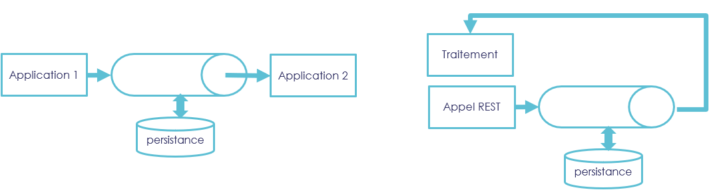
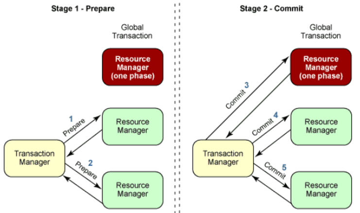

# **Formation Java Backend**

Les fondamentaux (et un peu plus 🚀)

## Module 3

---

# Sécurité

▌ Principe de base : n’ayez jamais confiance dans celui qui vous appelle !

▌ Quelques règles de bonne pratique*

- Par défaut, interdisez tout
- Sécurisez les point d’entrée
- Validez les données en entrée
- Authentifiez l’utilisateur
- Vérifier qu’il a le droit d’accéder / modifier la donnée

---

# Sécurité

Dans le cas d’un site internet :

- Limitez les appels CORS au minimum (appels cross domaine)
  – Quel site internet est autorisé à m’appeler ?
- Activez le CSRF si possible (besoin d’une session)
    - Jeton échangé lors des appels POST / PUT

---

# Sécurité - quelques notions


- Principaux protocoles de nos jours:
    - SAML
    - OAuth 2.0

- Problématiques récurrentes :
    - Exposition du token
    - Durée de vie
    - Expiration
    - SSO

---

# Sécurité - Spring Security

```xml

<dependency>
  <groupId>org.springframework.boot</groupId>
  <artifactId>spring-boot-starter-security</artifactId>
</dependency>
```

Comportement de base

- Page de login `/login`, url de logout `/logout`
- Tout est sécurisé, sauf ce qui se trouve dans public

---

# Sécurité - Spring Security - Authentication


<!-- 
SecurityContextHolder - The SecurityContextHolder is where Spring Security stores the details of who is authenticated.
SecurityContext - is obtained from the SecurityContextHolder and contains the Authentication of the currently authenticated user.
Authentication - Can be the input to AuthenticationManager to provide the credentials a user has provided to authenticate or the current user from the SecurityContext.
GrantedAuthority - An authority that is granted to the principal on the Authentication (i.e. roles, scopes, etc.)

AuthenticationManager - the API that defines how Spring Security’s Filters perform authentication.
ProviderManager - the most common implementation of AuthenticationManager.
AuthenticationProvider - used by ProviderManager to perform a specific type of authentication.
Request Credentials with AuthenticationEntryPoint - used for requesting credentials from a client (i.e. redirecting to a log in page, sending a WWW-Authenticate response, etc.)
-->

L'authentification repose sur:

- `Authentication Manager` - l'API
- `ProviderManager` - l'implémentation la plus commune
- Un ensemble de `AuthenticationProvider` - les providers d'authentification

---

# Sécurité - Spring Security - Authorization

- Tout dépend de la notion de `GrantedAuthority`, interface qui possède une simple méthode

```java
String getAuthority();
```

- Souvent laissé à la main de l'utilisateur
- Historiquement Spring gère une notion de "rôle" et "privilèges" (avec le rôle préfixé par `ROLE_`)
    - Mais en réalité, cela est souvent mappé vers une simple string et la notion interne
      de `GrantedAuthority`
- 🚨 Dans les dernières versions de Spring Security, roles et privilèges sont similaires

---

# Sécurité - Spring Security

La sécurisation peut se passe à plusieurs niveaux:

- Via la configuration des endpoints
- Via des annotations
    - Dans la configuration:  `@EnableMethodSecurity `
    - Dans vos controlleurs:  `@PreAuthorize(XXX)`
        - `permitAll` : public
        - `isAuthenticated()` : l’utilisateur est authentifié
        - `hasAuthority(‘…’)` : l’utilisateur dispose du droit demandé
        - `hasAnyAuthority(‘…’)` : l’utilisateur dispose d’au moins un des droits demandé

---

# TP 11 - Spring Security

<!-- _class: invert -->
<!-- _backgroundImage: none -->

1. Ajoutez la dépendance

```xml

<dependency>
  <groupId>org.springframework.boot</groupId>
  <artifactId>spring-boot-starter-security</artifactId>
</dependency>
```

1. Récupérer les éléments suivants (TP11)
    - `SecurityConfiguration.java`

---
<!-- _class: invert -->
<!-- _backgroundImage: none -->

- Mettre à jour le TodoService pour associer le user au todo à la création
- Essayer de s’authentifier dans la GUI
- Sécuriser les WebServices Todo (annotation `@PreAuthorize`)
    - findAll -> Public (permitAll)
    - create -> privilège « add » (`hasAuthority('add')`)
    - update, complete, delete -> Authentifié (`isAuthenticated()`)
    - deleteAll -> Admin (`hasAuthority(‘admin’)`)
- Vérifier que ce niveau de sécurité fonctionne (notamment le deleteAll)
- Mettre en place un contrôle du droit de modification de la donnée (`todoCustomRepositoryImpl`)
    - seul le propriétaire peut modifier ou supprimer ses Todos
    - Un admin peut modifier ou supprimer n’importe lequel

---
# TP 11 - Spring Security

<!-- _class: invert -->
<!-- _backgroundImage: none -->
▌ **Redescendre le User dans la Gui sous forme d’une String dans TodoDto**

Ajouter l’attribut « String user » dans TodoDto

Ne pas mapper le user du Dto vers le Modèle

Mapper le user du modèle vers le Dto (sous-attribut)

---
# Gestion des erreurs - Code applicatif

En java, il existe plusieurs types d'erreur :

- Erreur de syntaxe : sera détectée à la compilation
- Les `Error`: indiquent un sérieux soucis que l'applicatif devrait pas tenter corriger (les resources du système sont déficientes)
    - e.g. `StackOverflowError`, `OutOfMemoryException`
- Les `Exception` : des erreurs applicatives, souvent gérées au niveau applicatif
    - `RuntimeException`: pas besoin de code pour les gérer - **gestion implicite**
    - `Exception` : ou "checked" exception - à déclarer dans votre code **gestion explicite**


<!--
La classe RuntimException modélise des erreurs d'exécution d'une application que l'on ne gère pas non plus, mais qui ont un statut différent. 
Elles signifient qu'une opération non prévisible a eu lieu. Par exemple l'appel d'une méthode au travers d'un pointeur nul, qui va générer la bien connue `NullPointerException`. 
Autre exemple : la division par zéro ( `ArithmeticException`) ou la lecture d'un tableau au-delà de sa limite ( `ArrayIndexOutOfBoundsException`). 
Ce genre de choses n'est pas censé arriver dans une application normalement constituée. 

À la différence de la classe Error et la classe RuntimeException, la classe Exception modélise les erreurs 
d'exécution que l'on doit prévoir. 
Parmi elles : l'impossibilité d'ouvrir un fichier ou de se connecter à une ressource réseau. 
Ces erreurs sont prévisibles, et le développeur doit proposer un comportement si elles interviennent. 
-->


---
# Gestion des erreurs - Cas des WebServices

- Une conversion est à faire entre le code java (`Exception`, `Error`) et le code HTTP.
**3+ options:**
- `@ResponseStatus` sur votre exception
- `@ExceptionHandler` au niveau de votre controller 
- `@ControllerAdvice` au niveau global

```java
@ControllerAdvice
public class GlobalRestExceptionHandler extends ResponseEntityExceptionHandler {

  @ExceptionHandler({AppRuntimeException.class})
  public ResponseEntity handleAppRuntimeException(HttpServletRequest req,
          AppRuntimeException exception) {
    return new ResponseEntity<>(HttpStatus.INTERNAL_SERVER_ERROR);
  }
}
```

---
# Gestion des exceptions - A retenir 📇

- Toujours "logger" vos exceptions **ou** "re-thrower" 
- Ne pas utiliser les exceptions checked si on ne les gère pas ensuite ...
- Pensez au try with resource pour les ressources clossable : https://www.baeldung.com/java-try-with-resources

Lectures utiles :
- https://reflectoring.io/spring-boot-exception-handling/
- https://www.morling.dev/blog/whats-in-a-good-error-message/

---
# TP 12 - gestion des erreurs

<!-- _class: invert -->
<!-- _backgroundImage: none -->

1. Créer une AppForbiddenException et AppConflictException de type Runtime
2. Créer le RestExceptionHandler
   - `com.thales.formation.config.rest.RestExceptionHandler.java` qui étend  `ResponseEntityExceptionHandler`
   - Ajouter un handler `AppForbiddenException` retournant une `403` (`HttpStatus.FORBIDDEN`)
   - Ajouter un handler `AppConflictException` retournant une `409` (`HttpStatus.CONFLICT`)
3. Mettre à jour TodoCustomRepositoryImpl en conséquence
4. Tester dans la GUI

---
# Tâches schedulées / traitements batch

▌ **Annotation Spring : @Scheduled**

Paramètres :
- `cron` : Cron syntax
- `fixedDelay` : exécution toutes les x millisecondes **après l’exécution précédente**
- `fixedRate` : exécution toutes les x millisecondes

---
# Tâches schedulées / traitements batch

▌ TaskExecutor

Il s’agit du gestionnaire d’exécution. Permet notamment de définir un pool d’exécution

Pour Spring boot configuration : Déclarer un bean « Executor »

```java
@Bean
public Executor taskExecutor() {
  return Executors.newScheduledThreadPool(10);
}
```

---
# Tâches schedulées / traitements batch

▌ **Exécution asynchrone**

Activer les exécutions asynchrone : `@EnableAsync`
Annoter la méthode à rendre asynchrone : `@Async`
- Attention aux appels intra service !

---
# Tâches schedulées / traitements batch

▌ Batch d’export avec Spring Data JPA

- `@Transactional(readOnly = true)`
- Streamer les lignes
- Positionner un fetchSize

```java
@QueryHints(value = @QueryHint(name = org.hibernate.jpa.QueryHints.HINT_FETCH_SIZE, value = "1000"))
@Query("SELECT t FROM Todo t")
Stream<Todo> streamAllToExport();
```

---
# TP13 : Tâches schedulées / traitements batch

<!-- _class: invert -->
<!-- _backgroundImage: none -->

▌ **Ajouter la classe de configuration des tâches schedulées**

- `com.thales.formation.config.scheduling.SchedulingConfiguration.java`
- Annotations : `@EnableScheduling`, `@EnableAsync`, `@Configuration`
- Y ajouter un Executor

▌ **Créer un Scheduler d’export des Todos**

- `com.thales.formation.scheduler.ExportTodoScheduler.java`

▌ **Mettre à jour le service Todo pour exposer la méthode d’export**

- Celle-ci s’appuiera sur une nouvelle méthode du repository retournant un stream avec @QueryHint adapté

- Se contente d’afficher les lignes (system.out.println)

---
# Gestion des logs

Questions à se poser
- Quels événements logger ?
- Quelles informations doivent figurer dans la log pour être exploitable ?
- Quelle politique de roulement dans les logs ?
- Combien de jours conserver les logs ?
- Quelle volumétrie cela va représenter ?
- Toujours logger l’exception à moins d’avoir une bonne raison
  - Pas de e.printStackTrace()
  - Pas de System.out.println()

---
# Gestion des logs

- Interface de logging
- Supporte plusieurs implémentations (ex : log4j, logback…)
- 5 niveaux de log :
  - `TRACE`
  - `DEBUG`
  - `INFO`
  - `WARN`
  - `ERROR`

---
# Gestion des logs - Logback

- Intégré dans Spring, configuration par un fichier `logback.xml`

```xml
<configuration>
    <appender name="console" class="ch.qos.logback.core.ConsoleAppender">
        <encoder>
            <pattern>%d{HH:mm:ss.SSS} %-5level %logger{36} - %msg%n</pattern>
        </encoder>
    </appender>
  
    <appender name="file" class="ch.qos.logback.core.FileAppender">
        <file>/tmp/logback.log</file>
        <append>true</append>
        <immediateFlush>true</immediateFlush>
        <encoder>
            <pattern>%d{HH:mm:ss.SSS} [%thread] %-5level %logger{36} - %msg%n</pattern>
        </encoder>
    </appender>

    <logger name="com.sematext.blog">
        <appender-ref ref="console"/>
    </logger>
    <root level="info">
        <appender-ref ref="file" />
    </root>
</configuration>
```

<!-- 
Il peut y avoir plusieurs type d'appenders: 
- SMTPAppender – accumulates data in batches and send the content of the batch to a user-defined email after a user-specified event occurs
- AsyncAppender – appends the logs events asynchronously
- RollingFileAppender -  faire des rotations de logs en fonction de la taille, des jours, etc..
Il y la notion de filtres (LevelFilter , ThresholdFilter)

- MDC - Mapped Diagnostic Context, pour avoir du contexte additionnel
- Marker - Permet de tagger nos logs
-->

---
# Gestion des logs - Logback & Spring-Boot

- Automatiquement intégré via la dépendance `spring-starter-web`
- Se référer aux properties spring boot pour un premier niveau de configuration
```properties
logging.level.org.springframework.web=debug
logging.level.org.hibernate=error
```
- Possibilité d’utiliser les profiles spring dans la conf logback via `logback-spring.xml`:
```xml
<springProfile name="staging">
    <!-- configuration to be enabled when the "staging" profile is active -->
</springProfile>

<springProperty scope="context" name="fluentHost" source="myapp.fluentd.host"
                defaultValue="localhost"/>
```

---
# TP14 :  Gestion des logs

<!-- _class: invert -->
<!-- _backgroundImage: none -->

- Utiliser l’annotation `@Slf4j` de lombok pour déclarer un logger dans `ExceptionHandler`
  - En profiter pour supprimer tous les system.out.println... Et printStackTrace…
- Mettre des logs en `WARN`
- Passer le niveau de log de `RestExceptionHandler` à `ERROR` (application.properties):
  `logging.level.com.thales.formation.config.rest.RestExceptionHandler=ERROR`
- Constater l’impact

---
# JMS - Présentation

- Java Message Service
- Queue de message (providers / consumers)
- Communication asynchrone sans perte (persistance des messages, reprise sur erreur...)
- Possibilité d'émettre un message même si le "consommateur" n'est pas en ligne
- Un message est composé :
  - d'un header
  - de properties
  - d'un body

---
# JMS - cas d'usages

- Echanges asynchrones entre 2 traitements Java
- Rendre un traitement interne asynchrone tout en le fiabilisant (vs simple création de thread)



---
# JMS avec Spring

- Activation via l'annotation `EnableJms`
- Définition d'une `JmsListenerContainerFactory` custom
- Fonctionnement en embedded possible avec la conf `spring.artemis.mode=embedded`
- Ajout des dépendances nécessaires (par exemple avec ActiveMQ Artemis) :
```xml
<dependency>
  <groupId>org.springframework.boot</groupId>
  <artifactId>spring-boot-starter-artemis</artifactId>
</dependency>
<dependency>
  <groupId>org.apache.activemq</groupId>
  <artifactId>artemis-jakarta-server</artifactId>
  <scope>runtime</scope>
</dependency>
```

---
# JMS avec Spring (côté réception)

```java
@Component
public class SendEmailListener {
    @JmsListener(destination = "QUEUE_NAME", containerFactory = "customFactory")
    public void receiveMessage(EmailMessage email) {
        // l'argument correspondant au message reçu doit être sérialisable
    }
}
```

---
# JMS avec Spring (côté envoi)

```java
@Service
public class EmailService {
    /** fourni par Spring */
    @Autowired
    private JmsTemplate jmsTemplate;
    public void sendEmail(EmailMessage emailMessage) {
        jmsTemplate.convertAndSend("QUEUE_NAME", emailMessage);
    }
}
```

---
# TP15 : JMS

<!-- _class: invert -->
<!-- _backgroundImage: none -->

- Configurer Spring Boot (ajout des deps Maven et config Spring à reprendre du TP15, package `com.thales.formation.config.jms`)
- Configurer ActiveMQ Artemis en mode embedded `spring.artemis.mode=embedded`
- Créer le message `EmailMessage`
  - Attributs : un email de destination et un contenu
- Créer un `EmailService` exposant une méthode pour envoyer un email 
  - Injecter `JmsTemplate` et l'utiliser pour l'envoi
- Mettre à jour `TodoService` pour envoyer un message en cas de supression de Todo 
  - S’appuyer sur une nouvelle property (`application.properties`) pour configurer l’email destinataire 
- Créer le listener correspondant `SendEmailListener`
  - Se contenter de logger l’information

---
# JMS - A retenir 📇

- Repose sur un runtime externe (ActiveMQ)
- Permet de mettre en place de l'asynchrone
- Pour du Java uniquement
  - Possibilité de s'interfacer via **Spring Messaging** avec d'autres alternatives à JMS (avec Kafka, RabbitMQ, etc.) pour faire de la communication asynchrone

---
# REST du monde

- Pour de la communication synchrone via le protocole HTTP
- REST est un ensemble de contraintes et de normes visant à standardiser les échanges HTTP par de la sémantique
- Bonnes pratiques: 
  - Utilisation d'un `Repository` pour isoler la couche de communication du métier
  - Pensez aux erreurs qui peuvent survenir ! Quel doit être l'impact sur le traitement ? Faut-il retry ?
- Depuis Spring 5, on préfère l'interface `WebClient` à `RestTemplate`
- L'utilisation de librairies de client HTTP tierces est également possible
  - Spring propose une intégration avec [Feign](https://spring.io/projects/spring-cloud-openfeign)

---
# TP16 : REST du monde

<!-- _class: invert -->
<!-- _backgroundImage: none -->

- Démarrer le projet `email-project` avec la commande `mvn spring-boot:run`
  - endpoint exposé : `POST http://localhost:9090/api/email`
  - Body attendu (exemple): `{ to: 'email', content: 'body'}`
- Ajouter les dépendances nécessaires à la mise en place d'un client HTTP dans votre `todo-project`
- Créer un repository `EmailRepository`
- Utiliser un `EmailDto` correspondant à l'interface attendue 
- A la réception d'un message par le `SendEmailLister`, appeler l'endpoint HTTP via le `EmailRepository`

---
# JTA - XA

- Permet de synchroniser des transactions entre des datasources différentes
- Les datasources doivent supporter les transactions XA (par ex. PosgreSQL et ActiveMQ)
- Mécanisme de 2-phase commit
  - Avant le commit, chaque datasource reçoit un premier appel "prepare"
  - Quand toutes les datasources ont confirmées, le gestionnaire de transaction demande aux datasources de commiter



---
# JTA - XA

- Repose sur des transactions managers JTA OpenSource
- Plusieurs implémentations sont compatibles avec Spring
  - Atomikos
  - Bitronix
  - Narayana
  - ou le transaction manager du server JEE

---
# JTA - XA - A retenir 📇

- Ceinture bretelle
- A un impact sur les perfs
- Peut mener à des blocages
- Complexe à mettre en place et maintenir
- Liens utiles
  - https://docs.spring.io/spring-boot/docs/current/reference/htmlsingle/#io.jta

---
# OpenAPI

- Spécification pour documenter les APIs HTTP
- L'intégration avec Spring se fait par un jeu d'annotations
- Depuis Spring Boot 3.x, nécessite la dépendance `springdoc` plutôt que `springfox` (précédemment)

```xml
<dependency>
    <groupId>org.springdoc</groupId>
    <artifactId>springdoc-openapi-starter-webmvc-ui</artifactId>
    <version>2.1.0</version>
</dependency>
```

- Swagger est une suite d'outils implémentant la spécification OpenAPI pour concevoir des API HTTP

---
# OpenAPI

- Permet plusieurs approches de conception
  - top-down: génération du code depuis la spécification OpenAPI
  - bottom-up: génération de la documentation depuis le code de l'API
- Des plugins Maven permettent d'automatiser ces approches
  - `springdoc` permet de générer automatiquement la doc OpenAPI depuis votre code
  - `swagger-codegen` permet de générer du code à partir d'une spec OpenAPI

---
# TP17 - Swagger

<!-- _class: invert -->
<!-- _backgroundImage: none -->

- Génération de la doc OpenAPI
  - Ajouter la dépendance
  ```xml
  <dependency>
      <groupId>org.springdoc</groupId>
      <artifactId>springdoc-openapi-starter-webmvc-ui</artifactId>
      <version>2.1.0</version>
  </dependency>
  ```
  - Accéder à la spec OpenAPI via le endpoint `/v3/api-docs`
  - Accéder à la représentation Swagger UI via le endpoint `/swagger-ui/index.html`

---
# TP17 - Swagger

<!-- _class: invert -->
<!-- _backgroundImage: none -->

- Générer automatiquement la spec OpenAPI avec le plugin Maven `springdoc-maven-plugin`

```xml
<plugin>
    <groupId>org.springdoc</groupId>
    <artifactId>springdoc-openapi-maven-plugin</artifactId>
    <version>1.4</version>
    <executions>
        <execution>
            <phase>integration-test</phase>
            <goals>
                <goal>generate</goal>
            </goals>
        </execution>
    </executions>
</plugin>
```

NB: regarder la configuration dans le pom.xml du TP17

---
# TP17 - Swagger

<!-- _class: invert -->
<!-- _backgroundImage: none -->

- Dans l'autre sens, utiliser le plugin `swagger-code-gen` pour générer du code à partir d'une spec OpenAPI
- Une spec OpenAPI est dispo dans `src/main/resources/openapi.json` du TP17
- Exécuter le plugin via la commande `mvn clean compile`

NB: 
- se référer à la doc du plugin maven https://github.com/swagger-api/swagger-codegen/tree/master/modules/swagger-codegen-maven-plugin
- le code généré nécessite des dépendances spécifiques qu'il faudra rajouter dans le pom.xml du projet, cf. https://github.com/swagger-api/swagger-codegen/issues/5410

---
# Spring AOP

- Objectif: Venir rajouter du comportement autour de classes, fonctions... (cross-cutting concerns)

- Dépendance Spring Boot dispo
```xml
<dependency>
    <groupId>org.springframework.boot</groupId>
    <artifactId>spring-boot-starter-aop</artifactId>
</dependency>
```

- Annotation `@Aspect` à positionner sur un `@Component`

- Définition d’un point cut (à quel endroit se place l’exécution du comportement), à placer sur la méthode à appeler

---
# AOP - Terminologie

- **Aspect**: La problématique spécifique que l’on veut ajouter transversalement à notre architecture : par exemple la gestion des transactions avec la base de données
- **JoinPoint**: Le point dans le flot d’exécution d’un programme à partir duquel on souhaite ajouter la logique d’exécution de l’aspect
- **Advice**: L’action particulière de l’aspect à exécuter quand le programme atteint le point de jonction
- **Pointcut**: Une expression qui définit l’ensemble des joinpoints éligibles pour l'advice

<!-- 
Source: https://gayerie.dev/docs/spring/spring/aop.html 
-->

---
# Spring AOP

La value de l’annotation définit le pointcut (ex : package visé, caractéristique de la fonction, présence d’une annotation…)

`@Around` : Enveloppe l’exécution de la cible
`@Before` : Avant d’appeler la cible
`@After` : Après avoir appelé la cible
`@AfterReturning` : Après avoir appelé la cible (résultat OK)
`@AfterThrowing` : Après avoir appelé la cible (et si celle-ci génère une exception)

Utiliser `ProceedingJoinPoint pjp` pour récupérer des infos sur l’appel

---
# Spring AOP

> Cas d'utilisations classiques
- Cibler les fonctions d'un package / d'une classe avec `@Around("* my.package..*(..)")`
- Cibler des méthodes annotées
  - Créer une annotation
  ```java
  @Target(ElementType.METHOD)
  @Retention(RetentionPolicy.RUTIME)
  public @interface LogExecutionTime {}
  ```
  - puis l'utiliser dans un pointcut `annotation(myAnnotation)`
  ```java
  @Around("@annotation(let)")
  public Object logExecutionTime(ProceedingJoinPoint jp, LogExecutionTime let) {
    return jp.proceed();
  }
  ```

<!-- 
Multitude d'autres possibilités !
-->

---
# TP18 - Spring AOP

<!-- _class: invert -->
<!-- _backgroundImage: none -->

- Créer une annotation `LogExecutionTime`
- Créer un aspect `LogExecutionTimeAspect` qui va intercepter les méthodes annotées `LogExecutionTime` et logger leur durée d'exécution

---
# Spring AOP - A retenir 📇

- A utiliser avec parcimonie !
- Peut avoir un impact sur les perfs
- Peut masquer du métier (et perdre en maintenabilité)
- Ralentit le temps de démarrage
> Préciser au maximum la cible (packages, classes, ...) pour limiter le scan des classes

---
# Design pattern

- GoF
  - Gang of Four (1994): Erich Gamma, Richard Helm, Ralph Johnson, John Vlissides
  - 23 patterns
    - Creational
    - Structural
    - Behavioral
- EIP
  - Entreprise Integration Pattern
  - 65 patterns de plus haut niveau
    - ESB, Apache Camel, Spring Integration, ETL, etc.

> Bon point d'entrée: https://refactoring.guru/